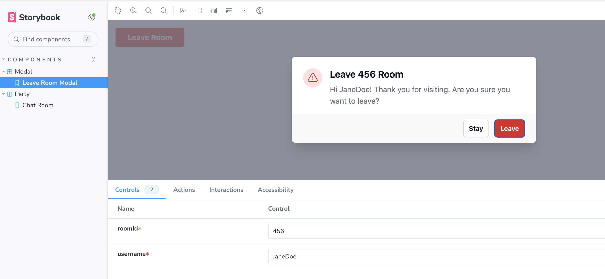
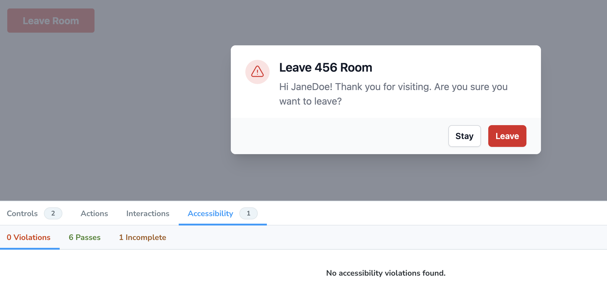

# Astro Partykit Minimal Starter Kit

This is a minimal starter kit for [Astro](https://astro.build) and [Partykit](https://partykit.io) using [React](https://reactjs.org/).

## 🧞 Commands

All commands are run from the root of the project, from a terminal:

| Command                   | Action                                                                                                             |
| :------------------------ | :----------------------------------------------------------------------------------------------------------------- |
| `npm install`             | Installs dependencies                                                                                              |
| `npm run dev`             | Starts local dev server at `localhost:4321` as well as partykit on `localhost:1999`                                |
| `ntl dev`                 | Starts Netlify integration along with local dev server at `localhost:8888` as well as partykit on `localhost:1999` |
| `npm run build`           | Build your production site to `./dist/`                                                                            |
| `npm run preview`         | Preview your build locally, before deploying                                                                       |
| `npm run astro ...`       | Run CLI commands like `astro add`, `astro check`                                                                   |
| `npm run astro -- --help` | Get help using the Astro CLI                                                                                       |
| `npm run storybook`       | Starts Storybook on `localhost:6006`                                                                               |
| `npm run build-storybook` | Generates a production-ready build of Storybook                                                                    |

If you plan to use Netlify, you need to install the [Netlify CLI](https://docs.netlify.com/cli/get-started/) to run `ntl dev`.

## 👀 Want to learn more about Astro?

Feel free to check [their documentation](https://docs.astro.build) or jump into their [Discord server](https://astro.build/chat).

## 👀 Want to learn more about Partykit?

Feel free to check [their documentation](https://docs.partykit.io/) or jump into their [Discord server](https://discord.gg/KDZb7J4uxJ).

## 🚀 Project Structure

Inside of your Astro project, you'll see the following folders and files:

```text
/
├── public/
├── party/
│   └── index.ts
├── src/
│   └── components/
        ├── Modal.stories.ts
        ├── Modal.tsx
        ├── Party.stories.ts
        └── Party.tsx
│   └── pages/
│       └── index.astro
│       └── chat/
│           └── index.astro
└── package.json
```

Astro looks for `.astro` or `.md` files in the `src/pages/` directory. Each page is exposed as a route based on its file name.

`src/components/` is where components go, Astro/React/Vue/Svelte/Preact components. For this starter project, we're using React, but feel free to switch to your favorite framework.

We have also added the Storybook stories for the components in `src/components/` to help you develop your components in isolation.

Any static assets, like images, can be placed in the `public/` directory.

## Using Storybook

This starter kit comes with Storybook pre-configured. You can run `npm run storybook` to start the Storybook server locally.



We have also added the `@storybook/addon-a11y` addon to help you make sure your components are accessible.



## Deployment

### Setting up Environment Variables

1. Run `npx partykit@latest token generate` to generate a token.
2. Run `ntl env:set PARTYKIT_LOGIN your-username` to add it to the environment variables for Netlify deploys.
3. Run `ntl env:set PARTYKIT_TOKEN THE_GENERATED_SUPER_SECRET_TOKEN` to add it to the environment variables for Netlify deploys.
4. Run `ntl env:set PUBLIC_PARTYKIT_HOST set-your-url-here` so that the production URL for Partykit is available for the deployment.

_Note_: The `ntl env:set` command is for Netlify deployments only. If you choose to deploy elsewhere, please refer to those particular docs on setting environment variables for your application.

### Deploy to Netlify

The project is configured to deploy to Netlify. For more information on deploying to Netlify, see [A Step-by-Step Guide: Deploying on Netlify](https://www.netlify.com/blog/2016/09/29/a-step-by-step-guide-deploying-on-netlify/).

If you'd like to deploy via the Netlify CLI, you can run the following commands:

```bash
npm install netlify-cli -g # Install the Netlify CLI
netlify init # Connect your project to Netlify
netlify deploy --build # Deploy your site add --prod for production
```

### Deploy to Partykit

For the Partykit side of things, you can use the [Partykit CLI](https://docs.partykit.io/cli).

```bash
npx partykit deploy
```

For more information see their [documentation](https://docs.partykit.io/guides/deploying-your-partykit-server).
